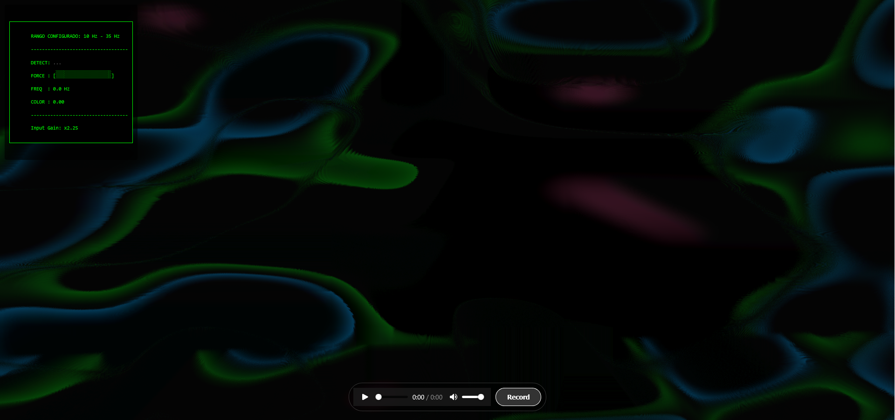

## hydra-music-recorder

A simple framework to customize Hydra visuals and record it along with music. 

Using  [Hydra](https://hydra.ojack.xyz/) to create audio-reactive visuals and generate music videos automatically.

The project is **two-fold**:

1. **Live Playing**: Customizable JavaScript patches for Hydra visuals that react to audio (see `hydra.js` and `hydra-shared.js`).
2. **Offline Recording**: Bash scripts to launch a local server and facilitate recording or live sessions (`start.sh`, `scripts/serve.sh`).

### Run

- **Record / file playback (default):** `./start.sh` or `./start.sh song.wav` (also `./start.sh record song.wav`).
- **Live input (mic / system capture via browser):** `./start.sh live` — then open `http://localhost:8123/live.html`, click to allow audio, pick your input (ASIO4ALL-backed devices appear if the OS exposes them to the browser). Recording is disabled in this page; visuals use `hydra_live.js` and shared logic in `hydra-shared.js`.
- **Live analyser options:** in `hydra_live.js`, `HydraShared.setLiveAnalyserOptions({ … })` can set:
  - **`freqMinHz` / `freqMaxHz`** — **colour mapping only** (log scale from low→high pitch to your HSV arc). **Pitch** is estimated with the **YIN** algorithm on the time-domain buffer (not “max autocorrelation”, which confused low vs high strings); FFT peak is only a fallback. Detection scans from ~55 Hz up to `freqMaxHz`. Defaults: `GUITAR_HZ_COLOR_*` in `hydra-shared.js`.
  - **`hueMinDeg` / `hueMaxDeg`** (0–360°) — HSV hue arc: low pitch → `hueMinDeg`, high pitch → `hueMaxDeg` (default full circle `0`→`360`). If `hueMaxDeg < hueMinDeg`, the arc crosses 0°.
- **Live page only:** press **R** to hide the mic panel and debug HUD (full-screen visuals only); press **R** again to show them.
- Optional: `OPEN_LIVE_BROWSER=1 ./start.sh live` tries to open the live URL (`xdg-open` / `wslview`).

> **Note — YIN (live pitch):** `live.html` uses **YIN** ([Cheveigné & Kawahara, 2002](http://audition.ens.fr/adc/pdf/2002_JASA_YIN.pdf)): for each lag τ it builds the **difference function** (sum of \((x[j]-x[j+\tau])^2\)), then the **cumulative mean normalized** version; the **first** good local minimum gives the **fundamental** \(f_0 = f_s/\tau\). Autocorrelation-by-maximum often favours harmonics and confuses low vs high strings. See `estimateLiveYinF0` in `hydra-shared.js` (FFT fallback if YIN fails).

For all the information about the project, check **[this post](https://agarnung.github.io/blog/hydra)**.

**YouTube Channel:** [https://www.youtube.com/@agarnungm](https://www.youtube.com/@agarnungm)

_Examples_:

<table style="width: 100%; border-collapse: collapse;">
  <tr>
    <td style="text-align: center; padding: 10px;">
      
      
<strong><a href="https://www.youtube.com/watch?v=HqKgcVJlu6E" target="_blank">Sinestesia</a></strong>

    </td>
    <td style="text-align: center; padding: 10px;">
      
      
<strong><a href="https://youtu.be/Ut4zZMRd_cc" target="_blank">Albedo</a></strong>

    </td>
    <td style="text-align: center; padding: 10px;">
      
      
<strong><a href="https://youtu.be/LwdEHEPYqjg" target="_blank">Sosiego</a></strong>

    </td>
  </tr>
  <tr>
    <td style="text-align: center; padding: 10px;">
      
      
<strong><a href="https://www.youtube.com/watch?v=O1qz4I04cRE" target="_blank">Zozobra</a></strong>

    </td>
    <td style="text-align: center; padding: 10px;">
      
      
<strong><a href="https://www.youtube.com/watch?v=D68Kswu17kI" target="_blank">Anhedonia</a></strong>

    </td>
    <td style="text-align: center; padding: 10px;">
      
      
<strong><a href="https://youtu.be/u_PhKfNZNbU" target="_blank">Anhelo</a></strong>

    </td>
  </tr>
</table>
